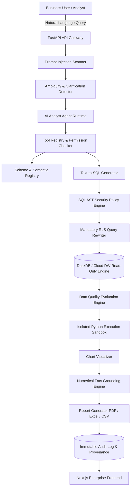

# Enterprise AI Data Analytics & Reporting Platform - System Architecture

## 1. System Architecture Overview

The **AI-Powered Enterprise Data Analytics & Reporting Platform** is built using Clean Architecture and Domain-Driven Design principles. The architecture isolates the AI Agent to function strictly as an untrusted query planner while placing deterministic security boundaries around database access, Python code execution, and data governance.

## 2. Core Logical Layers

1. **API Layer (`app/api/v1/`)**: Exposes REST endpoints for queries, authentication, schemas, metrics, reports, audit logs, and evaluations. Enforces JWT auth and RBAC permissions.
2. **AI Agent Layer (`app/ai/`)**: Agent state machine driving tool selection, intent analysis, clarification, and structured planning.
3. **Security Engine (`app/security/`, `app/query_engine/`)**:
   - `prompt_injection.py`: Multi-stage regex and semantic pattern scanner.
   - `ast_policy.py`: `sqlglot` AST parser blocking DDL/DML and non-SELECT operations.
   - `rls_enforcer.py`: Dynamic SQL AST transformer injecting tenant isolation predicates (`WHERE tenant_id = :tenant_id`).
   - `data_masking.py` & `llm_data_policy.py`: Column-level dynamic data masking for PII (`RESTRICTED` / `CONFIDENTIAL`).
   - `token_governance.py`: Per-tenant sliding-window rate limiter and token budget protection.
4. **Execution Sandbox (`app/sandbox/`)**: Dual-layer Python code analyzer combining static AST inspection with process/container isolation.
5. **Analytics & Grounding (`app/analytics/`)**: Evaluates data quality metrics and verifies generated AI business claims against exact query execution facts using numeric extraction and tolerance matching.
6. **Reporting (`app/reporting/`)**: Renders executive PDF, Excel, and CSV artifacts stored in tenant-isolated object paths.

---

## 3. Multi-Tenant Isolation Strategy & Trade-Offs

The platform currently implements **Shared-Process Logical Isolation (Row-Level Security)** via dynamic AST rewriting:

| Isolation Tier | Technical Mechanism | Advantages | Cost & Operational Trade-offs | Target Use Case |
|---|---|---|---|---|
| **Tier 1: Logical RLS (Current)** | SQL AST injected with `WHERE tenant_id = :id` | Zero infrastructure overhead, maximum resource utilization, unified connection pool | Logical boundary relies on query rewriter correctness; shared memory/disk | Demo, internal analytics, cost-sensitive SaaS |
| **Tier 2: Schema-per-Tenant** | Dedicated schema per tenant with role-based schema search paths | Physical catalog separation, independent schema backups, lower blast radius | Connection pool fragmentation, schema migration overhead across tenants | B2B multi-tenant enterprise platforms |
| **Tier 3: Database-per-Tenant** | Dedicated database instance/cluster per tenant | Absolute physical isolation, meets strict HIPAA/PCI compliance, zero noisy-neighbor risk | High infrastructure cost, operational complexity, cross-tenant analytics difficulty | Regulated healthcare (MIMIC clinical data), banking |

**Evolution Path**:
The query engine isolates tenant context via `TenantContext`. In Tier 2 and Tier 3 environments, `TenantContext` is mapped to dynamic database connection strings or catalog schemas, preserving identical AST policy and data masking logic.

---

## 4. Analytical Engine Scalability: DuckDB vs. Cloud Warehouses

### DuckDB Architectural Role
- **Purpose**: Embedded high-performance vectorized OLAP engine for local execution, self-contained demonstration, reproducible benchmarks, and CI/CD automation without cloud credentials.
- **Boundaries**: Single-process shared memory; optimal for up to tens of millions of rows per node and moderate concurrency (10–50 concurrent read queries).

### Cloud Data Warehouse Migration Path
The core governance middleware—AST Policy Engine (`sqlglot`), Dynamic RLS Rewriter, and CLS Masker—is **database agnostic**:
- **Snowflake / Google BigQuery / AWS Redshift**: Transitioning to enterprise cloud warehouses requires swapping the `sqlglot` read/write dialect (e.g., `dialect="snowflake"`) and replacing the connection pool driver with `snowflake-connector-python` or `google-cloud-bigquery`.
- All upstream governance (prompt scanning, intent routing, clarification, sandbox execution, and numerical grounding) remains unchanged.

---

## 5. Reliability & Fault Tolerance (Resilience Layer)

1. **Circuit Breaker**: Detects consecutive failures from upstream LLM providers (Google Gemini / OpenAI). If failures exceed the threshold, the circuit trips to `OPEN`, immediately directing requests to the local deterministic analysis engine or fallback provider without waiting for network timeouts.
2. **Exponential Backoff**: Transient HTTP 429 / 503 errors trigger backoff retries with randomized jitter to prevent thundering herd problems.
3. **Graceful Fallback**: Guarantees that analytical queries produce structured SQL results and deterministic charts even when external cloud AI APIs are unreachable.

---

## 6. Numerical Fact Grounding Methodology

Rather than relying on vague "100%" assertions, the grounding engine executes a deterministic verification pipeline:
1. **Numeric Extraction**: Regex-based extraction of numbers, currency values, percentages, and statistical metrics from candidate AI statements.
2. **Tolerance Cross-Referencing**: Matches extracted values against the executed SQL query result set with configurable relative tolerance ($\pm 0.5\%$) to accommodate floating-point rounding.
3. **Confidence Labeling**: Categorizes each assertion as `SUPPORTED`, `APPROXIMATED`, or `UNSUPPORTED` with provenance evidence attached to audit logs.
