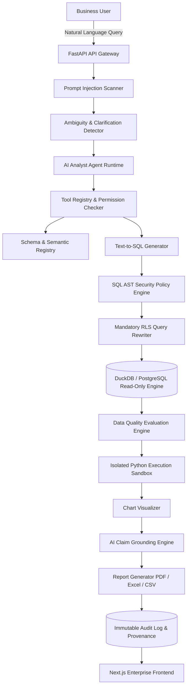

# Enterprise AI Data Analytics & Reporting Platform - System Architecture

## 1. System Architecture Overview

The **AI-Powered Enterprise Data Analytics & Reporting Platform** is built using Clean Architecture and Domain-Driven Design principles. The architecture isolates the AI Agent to function as an untrusted query planner while placing deterministic security boundaries around database access, Python code execution, and data governance.

## 2. Core Logical Layers

1. **API Layer (`app/api/v1/`)**: Exposes REST endpoints for queries, authentication, schemas, metrics, reports, audit logs, and evaluations. Enforces JWT auth and RBAC permissions.
2. **AI Agent Layer (`app/ai/`)**: Agent state machine driving tool selection, intent analysis, clarification, and structured planning.
3. **Security Engine (`app/security/`, `app/query_engine/`)**:
   - `prompt_injection.py`: Multi-stage regex and semantic pattern scanner.
   - `ast_policy.py`: `sqlglot` AST parser blocking DDL/DML and non-SELECT operations.
   - `rls_enforcer.py`: Dynamic SQL AST transformer injecting tenant isolation predicates (`WHERE tenant_id = :tenant_id`).
   - `data_masking.py` & `llm_data_policy.py`: Column-level dynamic data masking for PII (`RESTRICTED` / `CONFIDENTIAL`).
4. **Execution Sandbox (`app/sandbox/`)**: Dual-layer Python code analyzer combining static AST inspection with process/container isolation.
5. **Analytics & Grounding (`app/analytics/`)**: Evaluates data quality metrics and verifies generated AI business claims against exact query execution facts.
6. **Reporting (`app/reporting/`)**: Renders executive PDF, Excel, and CSV artifacts stored in tenant-isolated object paths.
